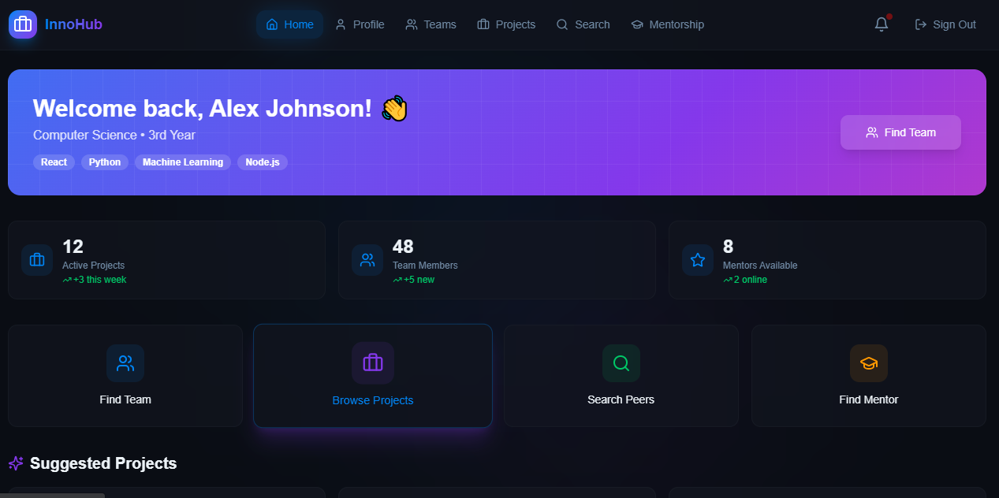
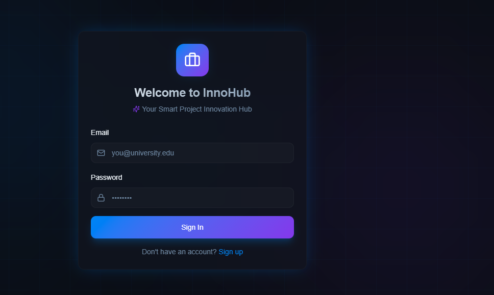

# Welcome to your The Innovation Hub


Project Structure :
```
BRAINSTORM1/
├── backend/                # Server-side logic (Node.js & Express)
│   ├── config/             # Database connections & environment configurations
│   ├── controllers/        # Business logic & request handling
│   ├── middleware/         # Security, Auth, and Validation layers
│   ├── models/             # Schema definitions (e.g., MongoDB/SQL)
│   ├── routes/             # API Endpoint definitions
│   └── server.js           # Main entry point for the backend
│
├── frontend/               # Client-side interface (React + Vite)
│   ├── src/                # Component logic, hooks, and pages
│   ├── index.html          # SPA entry point
│   ├── tailwind.config.ts  # Design tokens and styling configurations
│   ├── components.json     # UI component mapping (Shadcn/UI or similar)
│   └── tsconfig.json       # TypeScript configuration for type safety
│
├── Dockerfile              # Containerization for consistent deployments
└── render.yaml             # Infrastructure as Code (IaC) for cloud hosting
```

# 🚀 Get started

1. Frontend Setup (The UI)
- Open a new terminal window and navigate to the frontend directory.
```c
cd frontend
npm install   # or 'bun install'
npm run dev   # Runs on http://localhost:8080/
```

```
innovation-hub/
│
├── assets/
│   ├── homepage.png
│   ├── dashboard.png
```

## 📸 Project Preview

### 🏠 Home Page


### 📊 Dashboard


---

2. Backend Setup (The API)

- Navigate to the backend directory to install dependencies and start the server.

```
cd backend
npm install  
npm start     
```


## 📸 Project Preview
<p align="center">
  
  
</p>